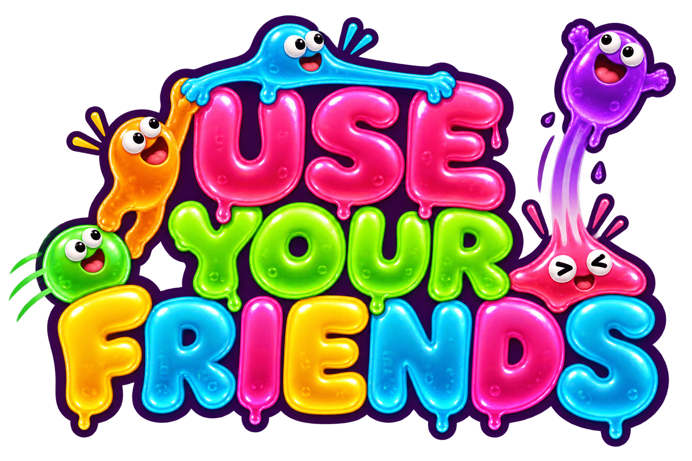
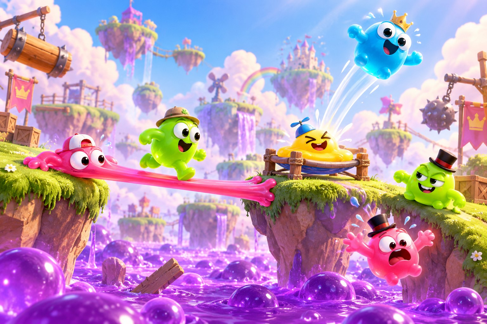
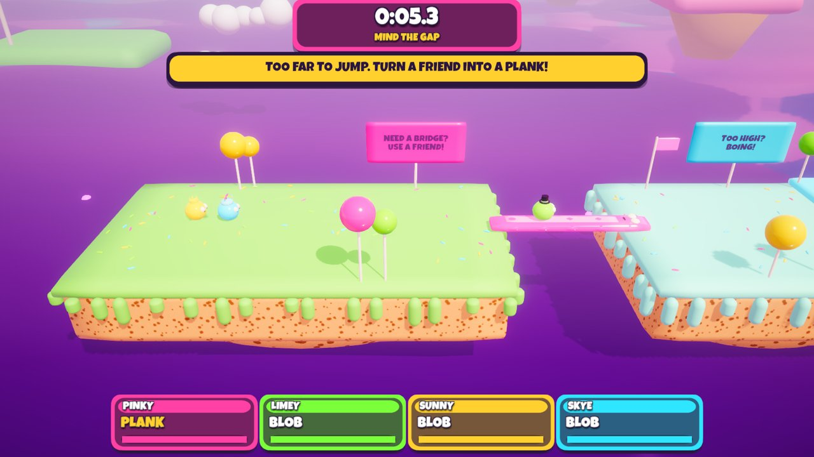
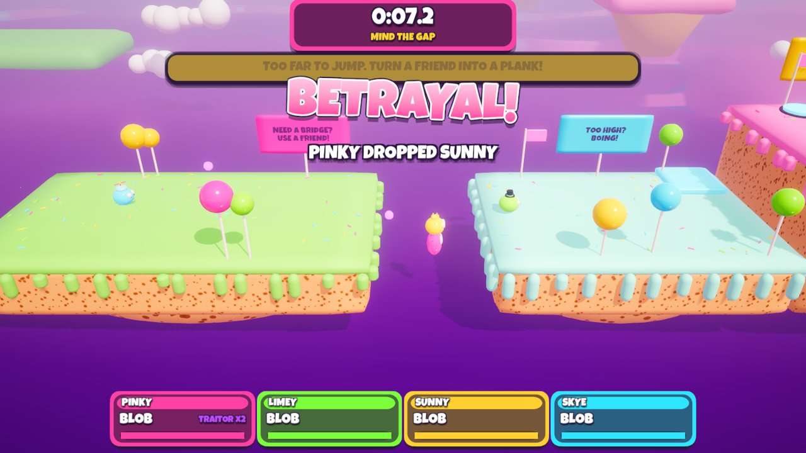
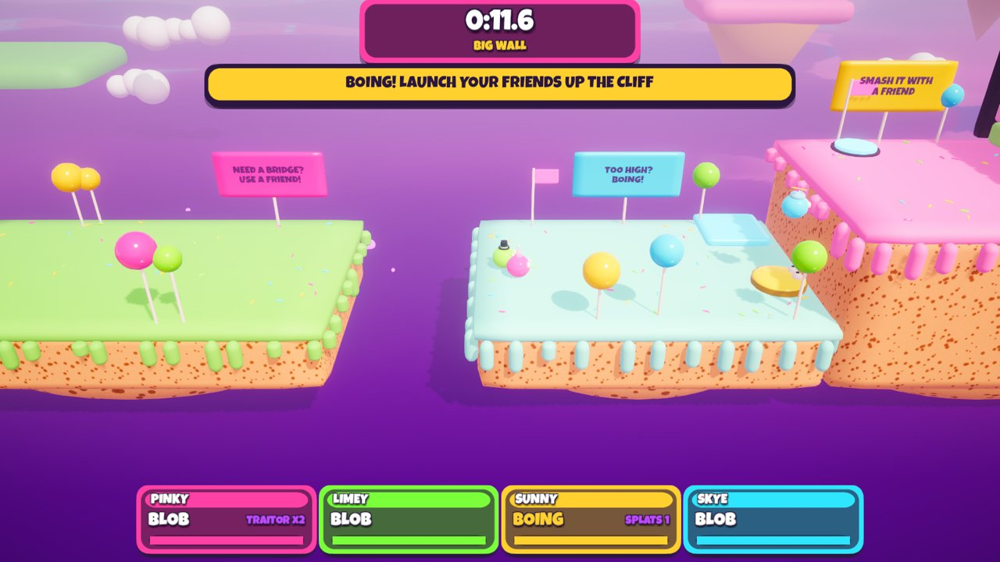
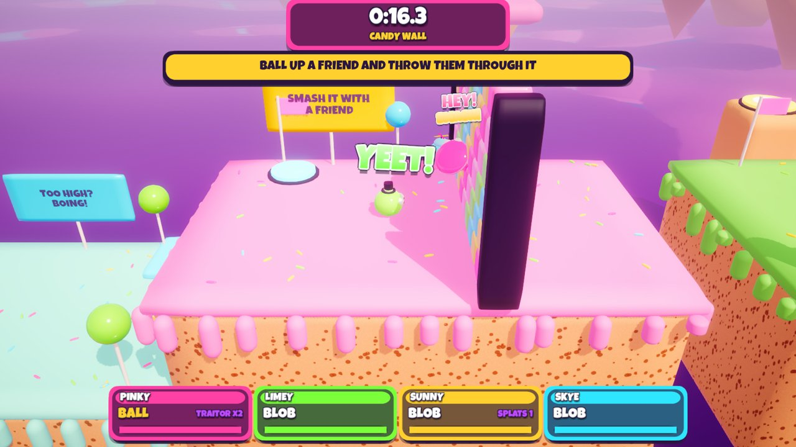
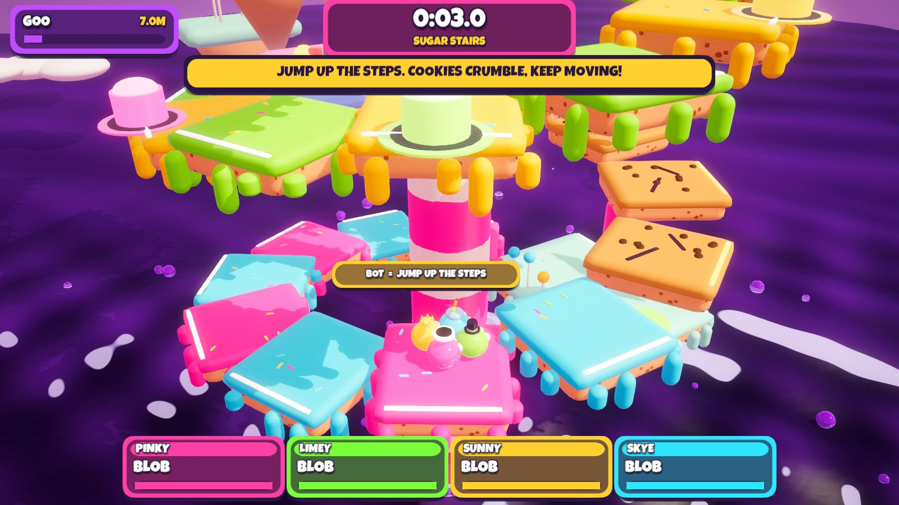
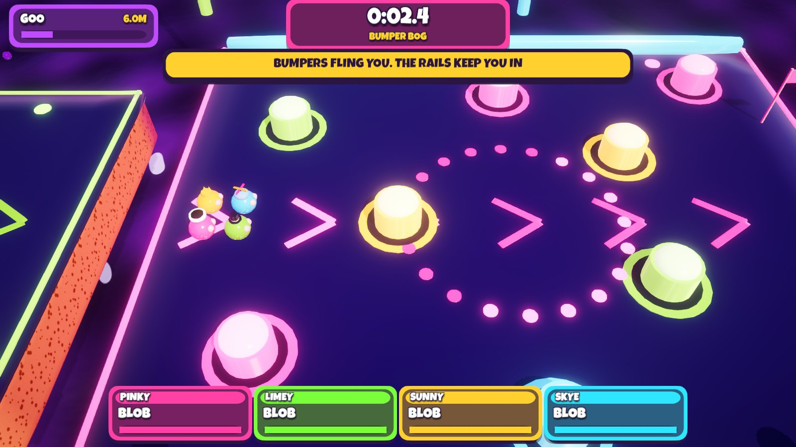
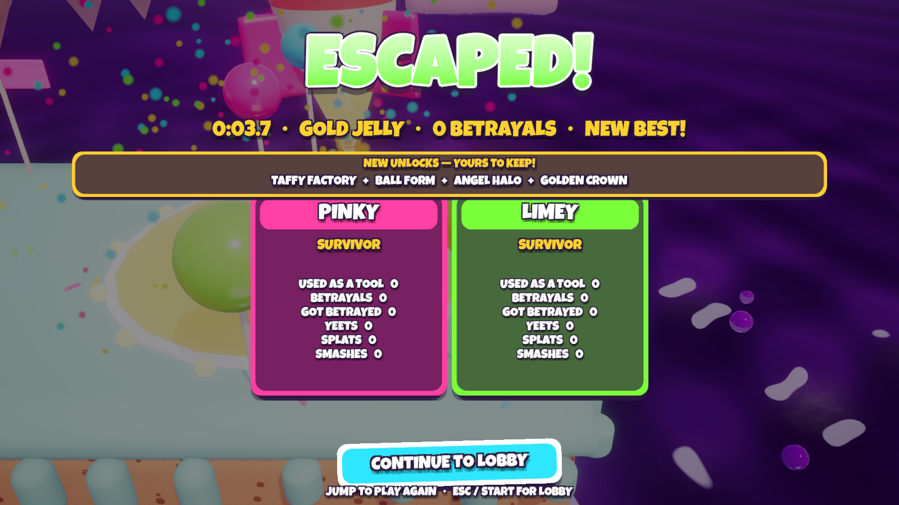
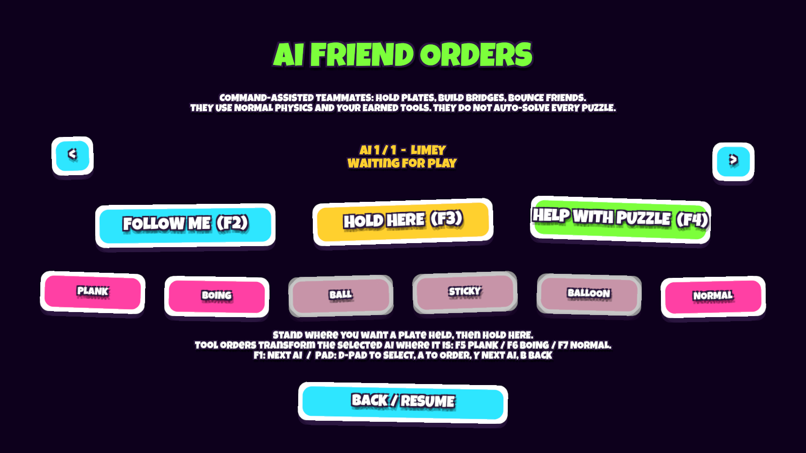

  

  <b>4 friends. Zero trust.</b> 
  Turn into tools. Use your friends. Try not to drop them.

<h2 align="center"><a href="https://github.com/grloper/use-your-friends-releases/releases/latest">⬇ Download the free Windows playtest</a></h2>

Windows 10/11 · 1–4 players · local or online co-op · updates itself

  

## Your friends are the equipment

A squishy co-op physics party game where the only tools you have are **each other**. Become a bridge, bounce your friends up a cliff, or get yeeted through a candy wall. Reach the escape rocket together… unless your bridge suddenly decides to stop being a bridge.

- **Throw it your way.** Tap Grab/Throw for a forward throw; hold for 0.3 seconds and release for a higher lob. A carried player escapes with one Jump press after a short grace period. [v0.10 foundations notes](RELEASE_NOTES_v0.10.0.md)—new story chapters and generated runs are still in development.
- **Solo, not alone.** Add up to three optional AI friends in the lobby. They follow, hold pressure plates and become tools—command-assisted teammates, not automatic all-level solvers. **I / gamepad Y** adds; **F8 / paused Y** opens orders. [AI controls and limits](AI_FRIENDS.md).
- **Earn your toolkit.** Start with a plank and trampoline. Beat levels to unlock the cannonball, sticky splat and balloon—and earn hats worth showing off.
- **Put friendship to work.** Seven levels, including **Sour Science Lab** and **Twin Tracks**: hold your friend's door, power their portal and be their counterweight.
- **Hear the panic.** Opt-in online proximity voice: hold **T / L3** to talk, with mute controls and muffled Ball voices.
- **Keep the receipts.** Slow-motion betrayal replays and opt-in five-second automatic captures. Captures are silent image sequences; an external ffmpeg encoder enables MP4 export.
- **Hurry.** The goo is rising, and it does not care whose fault it was.

  
   
  
   
  
  

<i>Be the bridge. Break the trust. Boing. Repeat.</i>

   
  <i>v0.8.0: real unlock celebrations. Screenshot from an automated test run.</i>

   
  <i>Solo, not alone: optional command-assisted AI friends. Actual game screenshot.</i>

## Bring your least reliable friends

Play on one PC with keyboards and controllers, or online: one friend presses **HOST ONLINE** and gets a 6-letter **room code**, everyone else presses **JOIN ONLINE** and types it. Direct connections depend on both routers and ISPs; if yours refuses, try [Tailscale](https://tailscale.com/download) (free) or the same Wi-Fi. Voice is unencrypted—use trusted rooms. Sour Science Lab and Twin Tracks require at least two players.

## Download

**Latest version: v0.10.0** · [Always get the newest release](https://github.com/grloper/use-your-friends-releases/releases/latest) · [All releases](https://github.com/grloper/use-your-friends-releases/releases)

| File | What it is |
|------|------------|
| [`UseYourFriends-Setup-v0.10.0.exe`](https://github.com/grloper/use-your-friends-releases/releases/download/v0.10.0/UseYourFriends-Setup-v0.10.0.exe) | Windows installer, recommended. No admin rights needed; the game updates itself. |
| [`UseYourFriends-v0.10.0-Win64-portable.zip`](https://github.com/grloper/use-your-friends-releases/releases/download/v0.10.0/UseYourFriends-v0.10.0-Win64-portable.zip) | Portable build, no installer and no auto-update. |
| [`UseYourFriends-Setup-v0.10.0.exe.sha256`](https://github.com/grloper/use-your-friends-releases/releases/download/v0.10.0/UseYourFriends-Setup-v0.10.0.exe.sha256) | SHA-256 checksum for the installer. |

**Requirements:** Windows 10/11 · 1–4 players on one PC (keyboards and controllers) or online co-op.

Later releases use the same file names with their own version number. If this table is behind, the [latest release](https://github.com/grloper/use-your-friends-releases/releases/latest) page is authoritative.

## Release notes

[v0.10.0](RELEASE_NOTES_v0.10.0.md) · [v0.9.2](RELEASE_NOTES_v0.9.2.md) · [v0.9.1](RELEASE_NOTES_v0.9.1.md) · [v0.9.0](RELEASE_NOTES_v0.9.0.md) · [v0.8.0](RELEASE_NOTES_v0.8.0.md)

## Install

1. Download **UseYourFriends-Setup-vX.Y.Z.exe** from the [latest release](https://github.com/grloper/use-your-friends-releases/releases/latest) and run it. No admin rights needed.
2. The playtest build is unsigned, so Windows may say *"Windows protected your PC"*: click **More info → Run anyway**.
3. From then on the game **updates itself**: an **UPDATE!** button appears on the main menu when there is a new version.

Prefer no installer? Every release also has a portable `.zip` (no auto-update).

### Troubleshooting

- **"Windows protected your PC":** expected for the unsigned playtest build; click **More info → Run anyway**.
- **Can't connect online:** direct connections depend on both routers and ISPs. Try [Tailscale](https://tailscale.com/download) (free) or the same Wi-Fi.
- **No UPDATE! button:** the portable `.zip` does not auto-update; download the newest release instead.

Free playtest, still in development. Expect rough edges. Blame your friends.

